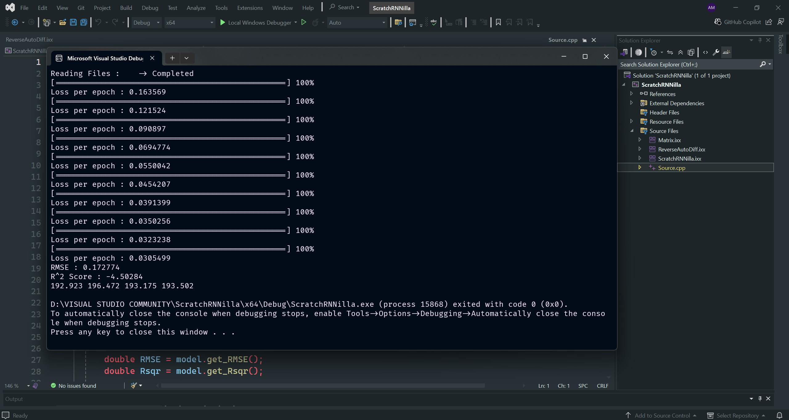

# ScratchRNNilla

`ScratchRNNilla` is a fully handwritten **Vanilla RNN regression model** framework developed in **C++20** using module files (`.ixx`). It is designed to predict **stock prices** using historical 5-year stock data and was built from the ground up with no machine learning libraries.

This project features:

* 🧮 Hand-crafted `Matrix` class with full support for linear algebra operations
* 🔁 Fully custom RNN architecture with `tanh` activation
* 🔄 Reverse-mode automatic differentiation (ReverseAutoDiff)
* 🧠 Stock price prediction with 5-year dataset
* ✂️ Gradient clipping, L2 regularization
* 📉 MSE loss for regression
* 📈 Metrics: RMSE, R² Score

---

## 🌱 Motivation

`ScratchRNNilla` aims to demonstrate that it's possible to design and train a sequence model from scratch — handling both forward propagation and dynamic gradient computation — using only modern C++20 features. It showcases how core ML building blocks like autodiff and matrix calculus work internally.

---

## 🧠 Architecture Diagram


---

## 🧮 Matrix Engine

At the core of the framework lies a robust and minimal `Matrix` class that implements:

* Element-wise and matrix multiplication
* Transpose and broadcasting support
* Matrix activation functions (`tanh`, `sigmoid`, `relu`)
* Gradients of activation functions (`dTanh`, `dSigmoid`, etc.)

The entire numerical engine is implemented manually, ensuring transparency over every computation.

---

## 🔄 Reverse Automatic Differentiation

`ReverseAutoDiff` is a custom autodiff engine for backpropagation:

* Each `Node` stores its value (`DATA`), gradient (`GRADIENT`), parents, and a backward lambda
* Operations like `+`, `-`, `*`, `elementwise`, `tanh`, `sigmoid` build a dynamic graph
* Calling loss function (like `MSE`) triggers backward propagation through the entire graph

This design allows the model to perform **gradient descent training** without any external dependency.

---

## 📊 Regression Use Case: Stock Market Prediction

This RNN model is trained to **predict future stock prices** based on a sequence of 4 features:

* Open
* High
* Low
* Close

### Dataset:

* Real stock CSV files over a **5-year period**
* Preprocessing includes normalization, splitting target from sequence, and padding

### Example Configuration:

* Layer size: 4 neurons
* Epochs: 10
* Learning rate: 0.01
* L2 penalty: 0.01
* Loss: MSE (Mean Squared Error)

---

## 🏋️ Training Loop

```cpp
model.RLayer(4, 4);
model.Train(dataset, target, 10, 0.01, 0.05, 0.01, 0.5);
```

---

## 📈 Evaluation Metrics

* Root Mean Squared Error (**RMSE**)
* Coefficient of Determination (**R² Score**)

These metrics help assess how well the model performs on real test data.

---

## 🖥️ Sample Output



---


## 📬 Author

**Ansham Maurya**
Email: [anshammaurya2291@gmail.com](mailto:anshammaurya2291@gmail.com)

> "The best way to master machine learning is to implement it from scratch."

---

## 📜 License

MIT License — free to use, modify, distribute, or fork.
